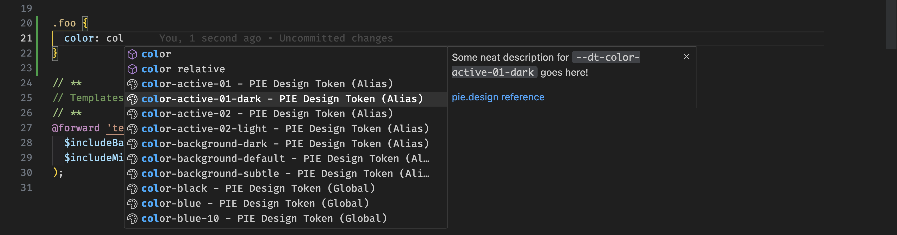
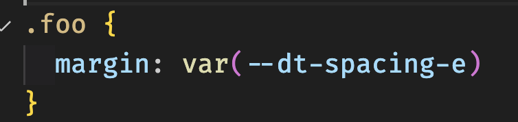
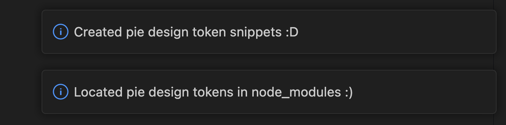
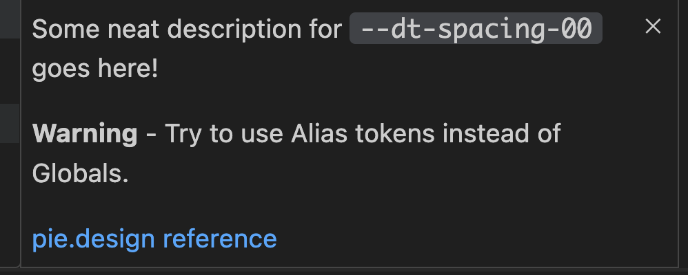
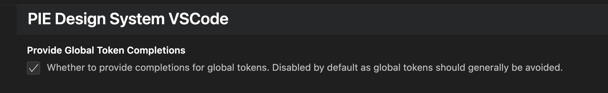

# pie-vscode README

This is a prototype vscode extension to provide intellisense and completion support for PIE Design system design tokens.

Works in CSS and SCSS files.

## Features

### Token hints and autocompletion
Provide hinting at what design tokens you can use. Some CSS properties, such as color or margin, will only provide applicable tokens to the CSS property you are writing. This prevents having to trawl through many design tokens you don't need.

When you select a token, the CSS variable version will be added to the line you're on.

### Plugs into your locally installed design tokens
The extension provides hints only for the tokens installed in your project!

### Token information
Each token has some (placeholder) information as well as a warning if it's a global token. Each token has a link to take you to it's page on our documentation website. This is currently placeholder.

### Enable global token support (if you really need it)
By default you will not see support for global tokens. Simply enable the extension setting to see them.

## Requirements

This extension requires your project to have version of `@justeat/pie-design-tokens` installed.

## Extension Settings

Include if your extension adds any VS Code settings through the `contributes.configuration` extension point.

For example:

This extension contributes the following settings:

* `pie-design-system-vscode-prototype.provideGlobalTokenCompletions`: Can be enabled to view global token support.

## Known Issues

This is completely placeholder and a prototype. Information for each token hasn't been added yet.